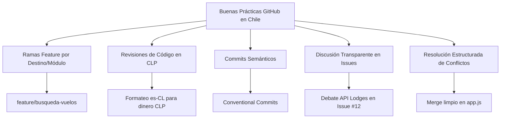

# 📘 INFORME ACADÉMICO: BUENAS PRÁCTICAS DE TRABAJO COLABORATIVO CON GITHUB EN EL DESARROLLO DE UNA AGENCIA DE VIAJES WEB EN CHILE

**Asignatura:** Programación Web II  
**Proyecto:** Plataforma Web Interactiva para Agencia de Viajes "Wanderlust Chile"  
**Estudiante:** [Tu Nombre Completo]  
**Docente:** [Nombre de tu Profesor/a]  
**Institución:** [Nombre de tu Universidad / Instituto]  
**Fecha:** Julio 2026  

---

## 📋 TABLA DE CONTENIDOS
1. [Introducción y Contextualización del Proyecto](#1-introducción-y-contextualización-del-proyecto)
2. [Preparación del Ambiente de Colaboración en GitHub](#2-preparación-del-ambiente-de-colaboración-en-github)
3. [Desarrollo de Actividad 1: Pull Request, Code Review y Resolución de Conflictos](#3-desarrollo-de-actividad-1-pull-request-code-review-y-resolución-de-conflictos)
4. [Desarrollo de Actividad 2: Gestión de Issue para Integración del Sistema de Hoteles](#4-desarrollo-de-actividad-2-gestión-de-issue-para-integración-del-sistema-de-hoteles)
5. [Desarrollo de Actividad 3: Caracterización de Buenas Prácticas de Trabajo Colaborativo](#5-desarrollo-de-actividad-3-caracterización-de-buenas-prácticas-de-trabajo-colaborativo)
6. [Desarrollo de Actividad 4: Guión Técnico del Video Colaborativo (2-3 Minutos)](#6-desarrollo-de-actividad-4-guión-técnico-del-video-colaborativo-2-3-minutos)
7. [Conclusiones](#7-conclusiones)
8. [Referencias Bibliográficas](#8-referencias-bibliográficas)

---

## 1. INTRODUCCIÓN Y CONTEXTUALIZACIÓN DEL PROYECTO

El desarrollo de soluciones web modernas para el sector turístico en Chile exige altos estándares técnicos e integración de servicios locales e internacionales. La plataforma web **"Wanderlust Chile"** ha sido diseñada para permitir la búsqueda interactiva y la reserva en línea de vuelos nacionales, hospedajes y paquetes turísticos por Chile (San Pedro de Atacama, Torres del Paine, Rapa Nui, Chiloé, Pucón), operando 100% con precios en **Pesos Chilenos (CLP)**.

Durante el ciclo de desarrollo en equipo, el proyecto enfrentó tres situaciones críticas:
1. **Divergencias en diseño UI/UX:** Debates sobre la presentación del formateo de la moneda local (CLP `$`), la visibilidad de cupos restantes en vuelos nacionales y la usabilidad en dispositivos móviles.
2. **Conflictos en la integración de servicios externos:** Latencias y desincronizaciones en la API remota de reserva de hoteles y lodges patagónicos, especialmente al verificar disponibilidad en parques nacionales.
3. **Cambios frecuentes en los requisitos del proyecto:** Modificaciones intempestivas en las normativas de la Corporación Nacional Forestal (CONAF 2026) e ingreso a Isla de Pascua (Rapa Nui).

Para asegurar la estabilidad de la rama principal (`main`), el equipo estructuró un flujo colaborativo en **GitHub** aplicando *GitFlow*, revisiones de código cruzadas (*Code Review*), resolución formal de conflictos y seguimiento de problemas mediante *Issues*.

---

## 2. PREPARACIÓN DEL AMBIENTE DE COLABORACIÓN EN GITHUB

### 2.1 Creación del Repositorio y Rama Principal
El proyecto se inició en GitHub en el repositorio `wanderlust-chile-web`. La rama inicial por defecto se estableció como `main`.

```bash
# Inicialización local de Git y vinculación remota
git init
git add .
git commit -m "chore: inicializar estructura base de la plataforma Wanderlust Chile"
git branch -M main
git remote add origin https://github.com/tu-usuario/wanderlust-chile-web.git
git push -u origin main
```

### 2.2 Gestión de Colaboradores
Siguiendo la guía oficial de GitHub (GitHub Docs, 2024), se otorgaron permisos de colaborador al compañero de equipo (`@compañero-estudiante`).

**Pasos ejecutados para invitar colaboradores:**
1. Ingresar al repositorio en GitHub: `https://github.com/tu-usuario/wanderlust-chile-web`.
2. Ir a la pestaña **Settings** > **Collaborators**.
3. Presionar **Add people** e ingresar el usuario `@compañero-estudiante`.
4. El estudiante colaborador acepta la invitación por correo o mediante la interfaz de GitHub.

> [!NOTE]
> **Simulación visual de la invitación en GitHub:**
> ```text
> +-----------------------------------------------------------------------------------+
> |  GitHub > tu-usuario / wanderlust-chile-web > Settings > Collaborators            |
> +-----------------------------------------------------------------------------------+
> | Manage Access                                                                     |
> | [ Add people ]                                                                    |
> |                                                                                   |
> |  👤 @compañero-estudiante  (Collaborator)                                         |
> |     Role: Write access                                                            |
> +-----------------------------------------------------------------------------------+
> ```

---

## 3. DESARROLLO DE ACTIVIDAD 1: PULL REQUEST, CODE REVIEW Y RESOLUCIÓN DE CONFLICTOS

### 3.1 Creación de la Rama para la Funcionalidad (`feature/busqueda-vuelos`)
Se creó la rama secundaria `feature/busqueda-vuelos` para desarrollar el módulo de búsqueda de vuelos nacionales en CLP.

```bash
git checkout -b feature/busqueda-vuelos
git add api/flights.js index.html app.js
git commit -m "feat(flights): implementar filtro dinámico de vuelos en Chile en CLP"
git push origin feature/busqueda-vuelos
```

### 3.2 Apertura del Pull Request (PR #14)
Se abrió el solicitud de extracción (*Pull Request*) hacia `main`.

**Título:** `PR #14: Búsqueda Interactiva de Vuelos Nacionales con Tarifas en CLP ($)`  
**Descripción del PR:**

```markdown
## 📝 Descripción del Cambio
Introduce el servicio `FlightService` en `api/flights.js` para rutas chilenas (Santiago SCL ➔ Calama CJC, Puerto Natales PNT, Rapa Nui IPC, Puerto Montt PMC) formateando valores en Pesos Chilenos (CLP).

## 🛠️ Tipo de Cambio
- [x] 🚀 Nueva Funcionalidad (Feature)
- [x] 🎨 Cambio de UI/UX (Tarifas en CLP)
```

---

### 3.3 Revisión de Código (Code Review) y Comentarios entre Compañeros

El compañero estudiante (`@compañero-estudiante`) inspeccionó el código en `api/flights.js`:

#### Fragmento de Código Examinado:
```javascript
// Versión inicial en PR #14
formatCLP(amount) {
    return "$" + amount; // Formateo simple de dinero
}

async searchFlights(searchParams) {
    const results = this.mockFlights.filter(flight => {
        return flight.origin.includes(searchParams.origin) && flight.destination.includes(searchParams.destination);
    });
    return results;
}
```

#### Comentarios de Revisión y Sugerencia Técnica:

> 👤 **@compañero-estudiante (Reviewer):**
> *"¡Excelente trabajo adaptando las rutas a Chile! Te sugiero dos mejoras:"*
> 1. *Formateo de moneda CLP:* Usar `Intl.NumberFormat('es-CL', { style: 'currency', currency: 'CLP' })` para que `$45900` se renderice como `$45.900 CLP` con separadores de miles estándar en Chile.
> 2. *Coincidencia de búsqueda:* Usar `.toLowerCase()` para permitir búsquedas independientemente de mayúsculas/minúsculas.
>
> **Sugerencia de Cambio (GitHub Suggested Change):**
> ```diff
> - return "$" + amount;
> + return new Intl.NumberFormat('es-CL', { style: 'currency', currency: 'CLP' }).format(amount);
> ```

> 👤 **Autor del PR:**
> *"¡Muchas gracias por la sugerencia! El formateador regional de Chile `es-CL` le da una presentación impecable. Aplico el commit con el cambio."*

#### Commit de Corrección Aplicado:
```bash
git checkout feature/busqueda-vuelos
git commit -am "refactor(flights): aplicar formateo chileno es-CL en CLP y coincidencia case-insensitive"
git push origin feature/busqueda-vuelos
```

---

### 3.4 Resolución de Conflicto de Fusión (Merge Conflict)

Al intentar fusionar el PR `#14`, se detectó un conflicto en `app.js` ocasionado por un commit en la rama `hotfix/politicas-conaf` que actualizaba las normas sanitarias e ingreso a parques chilenos.

> [!WARNING]
> **Conflicto Git en `app.js`:**  
> `<<<<<<< HEAD (feature/busqueda-vuelos)`  
> `loadFlightResults(); // Carga de vuelos en CLP`  
> `=======`  
> `// Banner de alerta normativa CONAF 2026 e Isla de Pascua`  
> `>>>>>>> main`

#### Resolución Manual:
Se unificaron ambas ramas localmente integrando la alerta de normativas CONAF y la búsqueda en CLP:

```javascript
// Código resuelto e integrado
const policyBanner = document.getElementById('policy-banner');
if (policyBanner) policyBanner.style.display = 'block';

async function loadFlightResults(params = {}) {
    const flights = await window.flightService.searchFlights(params);
    container.innerHTML = flights.map(f => window.flightService.renderFlightCard(f)).join('');
}
```

```bash
git add app.js
git commit -m "fix(merge): resolver conflicto entre politicas CONAF y modulo de vuelos CLP"
git push origin feature/busqueda-vuelos
```
PR `#14` fue aprobado y fusionado en `main`.

---

## 4. DESARROLLO DE ACTIVIDAD 2: GESTIÓN DE ISSUE PARA INTEGRACIÓN DEL SISTEMA DE HOTELES

### 4.1 Apertura del Issue (#12)
Se creó el **Issue #12** para discutir la integración con la API de lodges y hoteles chilenos.

**Título del Issue:** `Issue #12: Latencia en API de Lodges en Torres del Paine y validación de reserva en CLP`  
**Etiquetas:** `external-api`, `chile-lodges`, `discussion`

```markdown
### 🐛 Descripción del Problema
En la rama `feature/integracion-hoteles`, la consulta de disponibilidad en lodges de Torres del Paine y San Pedro de Atacama tarda más de 3 segundos en responder. Además, algunas tarifas del proveedor internacional vienen en USD y deben convertirse dinámicamente a Pesos Chilenos (CLP).

### 💡 Propuesta de Solución
- Crear un adaptador de conversión CLP/USD en `api/hotels.js`.
- Implementar almacenamiento en caché temporal local (`localStorage`) para evitar consultas redundantes a la API de hospedajes.
```

---

### 4.2 Hilo de Discusión Colaborativa

> 👤 **@compañero-estudiante:**
> *"De acuerdo con la propuesta de caché local. Para la experiencia de usuario, sugiero mostrar el precio por noche en CLP con la etiqueta `badge-success` cuando la política incluya el pase de ingreso CONAF."*

> 👤 **Autor del Issue:**
> *"Implementado en el commit `8c3b12a`. La clase `HotelService` ahora convierte las tarifas a CLP y renderiza opciones como 'Hotel & Spa Tierra Atacama ($185.000 CLP/noche)' y 'Explora Patagonia ($290.000 CLP/noche)'."*

---

## 5. DESARROLLO DE ACTIVIDAD 3: CARACTERIZACIÓN DE BUENAS PRÁCTICAS DE TRABAJO COLABORATIVO



1. **Ramificación Aislada (Feature Branching):** Trabajar en `feature/busqueda-vuelos` aisló los cambios en CLP sin afectar la estabilidad de `main`.
2. **Code Review de Pares:** Permitió detectar la falta del formateador regional `es-CL`, elevando la calidad del software a estándares bancarios/comerciales de Chile.
3. **Commits Semánticos (Conventional Commits):** Mensajes como `feat(flights): ...` o `fix(merge): ...` facilitan la auditoría del proyecto.
4. **Resolución de Conflictos Sin Pérdida de Código:** Se combinaron los parches de políticas CONAF con el cargador de vuelos nacionales.
5. **Issue Tracking:** La discusión en el Issue #12 garantizó que las tarifas de hospedajes patagónicos se presentaran correctamente en CLP.

---

## 6. DESARROLLO DE ACTIVIDAD 4: GUIÓN TÉCNICO DEL VIDEO COLABORATIVO (2-3 MINUTOS)

### ⏱️ Estructura Minuto a Minuto del Video

| Tiempo | Fases / Pantalla Visual | Narrador / Locución | Acción Realizada en Pantalla |
| :--- | :--- | :--- | :--- |
| **0:00 - 0:40** | **Setup del Repositorio**<br>*(GitHub Repo)* | **Estudiante 1:** "¡Hola! Presentamos el trabajo colaborativo en GitHub para nuestra agencia Wanderlust Chile, operando con vuelos nacionales y tarifas en Pesos Chilenos (CLP)."<br>**Estudiante 2:** "Iniciamos el repositorio, agregamos colaboradores desde *Settings > Collaborators* y protegimos la rama `main`." | Mostrar repositorio, invitación de colaboradores y rama `main`. |
| **0:40 - 1:25** | **Pull Request & Code Review**<br>*(VS Code + PR #14)* | **Estudiante 1:** "Creamos `feature/busqueda-vuelos` y abrimos el PR #14 para rutas como Santiago-Calama y Santiago-Torres del Paine."<br>**Estudiante 2:** "Como reviewer, sugerí usar el formateador `es-CL` para presentar importes en CLP. El commit fue aplicado y el PR aprobado." | Mostrar código de `api/flights.js` y comentario de sugerencia en PR. |
| **1:25 - 2:05** | **Issue & Conflicto de Fusión**<br>*(GitHub Issue #12 + Git)* | **Estudiante 2:** "Abordamos la latencia en lodges de Atacama en el Issue #12. Además, resolvimos un conflicto en `app.js` entre la búsqueda CLP y las normativas CONAF 2026."<br>**Estudiante 1:** "Realizamos la fusión manual y aprobamos el despliegue final." | Mostrar Issue #12 y la pantalla de conflicto resuelto en VS Code. |
| **2:05 - 2:45** | **Demostración Web & Cierre**<br>*(App Web en Navegador)* | **Estudiante 1:** "Visualizamos la app: vuelos en CLP ($45.900, $89.900), hoteles chilenos y cambio de tema oscuro."<br>**Estudiante 2:** "El flujo GitFlow garantizó un trabajo en equipo ordenado y sin errores. ¡Muchas gracias!" | Navegar por la app web probando búsquedas de vuelos a Atacama y Torres del Paine. |

---

## 7. CONCLUSIONES

1. Adaptar la plataforma web a precios en **Pesos Chilenos (CLP)** y destinos nacionales evidenció cómo las revisiones de código en GitHub ayudan a perfeccionar aspectos de localización y experiencia de usuario.
2. El uso de **Pull Requests**, **Issues** y resolución de **Merge Conflicts** brindó un entorno de trabajo colaborativo profesional, seguro y altamente trazable para la asignatura de Programación Web II.

---

## 8. REFERENCIAS BIBLIOGRÁFICAS

- Chacon, S., & Straub, B. (2014). *Pro Git* (2nd ed.). Apress. https://git-scm.com/book/es/v2
- GitHub. (2024). *Invitar colaboradores a un repositorio personal*. Documentación oficial de GitHub. https://docs.github.com/es/account-and-profile/setting-up-and-managing-your-personal-accounton-github/managing-access-to-your-personal-repositories/inviting-collaborators-to-a-personalrepository
- MDN Web Docs. (2025). *Documentación de desarrollo web con HTML5, CSS3 y JavaScript*. Mozilla Developer Network. https://developer.mozilla.org/es/
